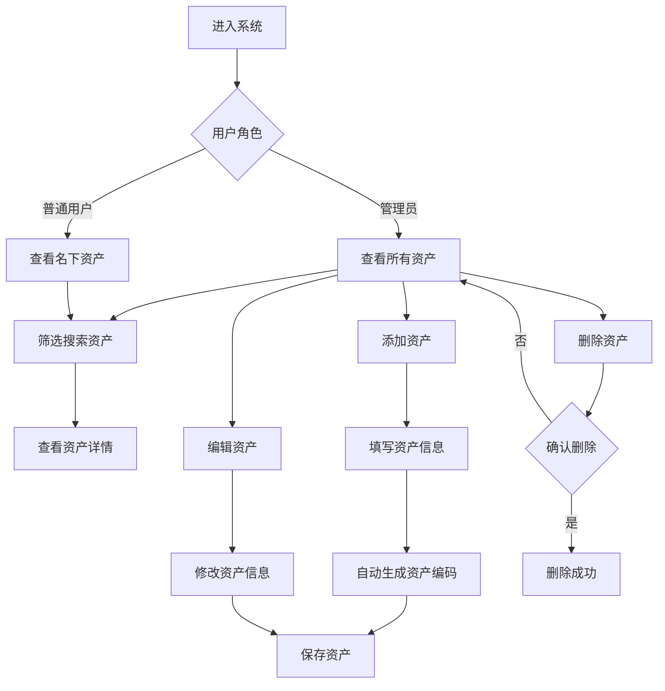

## 1. Product Overview
一个专业的IT资产管理网页应用，帮助企业高效管理IT资产的全生命周期。支持管理员和普通用户角色区分，提供资产查询、添加、编辑、删除等完整管理功能。

## 2. Core Features

### 2.1 User Roles
| Role | Registration Method | Core Permissions |
|------|---------------------|------------------|
| Admin | 默认账号 | 查询所有资产、增加/删除/修改资产、管理资产状态 |
| User | 默认账号 | 查询名下资产、查看资产详情 |

### 2.2 Feature Module
1. **资产列表页**：资产卡片展示、筛选搜索、角色权限控制
2. **资产详情页**：完整资产信息展示、使用信息查看
3. **资产管理页**：添加资产、编辑资产、删除资产

### 2.3 Page Details
| Page Name | Module Name | Feature description |
|-----------|-------------|---------------------|
| 资产列表 | 资产卡片列表 | 展示资产基本信息，支持分页和排序 |
| 资产列表 | 筛选搜索 | 按资产分类、状态、使用人等条件筛选 |
| 资产列表 | 角色权限 | 管理员查看全部资产，用户仅查看名下资产 |
| 资产详情 | 基本信息 | 展示资产编码、名称、分类、品牌、型号等 |
| 资产详情 | 使用信息 | 展示使用人、公司、部门、领用日期等 |
| 资产管理 | 添加资产 | 表单录入新资产信息，自动生成资产编码 |
| 资产管理 | 编辑资产 | 修改已有资产信息，状态变更记录 |
| 资产管理 | 删除资产 | 确认后删除资产记录 |

## 3. Core Process
用户登录系统 → 查看资产列表（管理员查看全部，用户查看名下）→ 点击查看详情 → 管理员可进行添加/编辑/删除操作 → 资产状态实时更新

## 4. User Interface Design

### 4.1 Design Style
- 主色调：科技蓝（#0F172A 深蓝、#3B82F6 亮蓝、#60A5FA 浅蓝）
- 辅助色：白色背景、灰色文字、绿色状态（正常）、黄色状态（维修中）、红色状态（故障）
- 按钮风格：圆角矩形，蓝色渐变，悬停效果
- 字体：Inter，清晰易读，专业感
- 布局：卡片式布局，左侧导航，右侧内容区域
- 图标：lucide-react 线性图标

### 4.2 Page Design Overview
| Page Name | Module Name | UI Elements |
|-----------|-------------|-------------|
| 资产列表 | 顶部工具栏 | 搜索框、筛选下拉、添加按钮 |
| 资产列表 | 资产卡片 | 圆角卡片、状态标签、操作按钮 |
| 资产详情 | 信息卡片 | 分栏展示基本信息和使用信息 |
| 资产管理 | 表单区域 | 输入框、下拉选择、日期选择器 |

### 4.3 Responsiveness
- 桌面端：左侧固定导航，右侧主内容区，卡片网格布局
- 移动端：顶部导航栏，卡片单列布局，菜单折叠
- 响应式断点：768px

### 4.4 交互设计
- 添加资产：表单验证、编码自动生成、保存成功提示
- 编辑资产：弹窗表单、修改确认提示
- 删除资产：二次确认弹窗、删除动画效果
- 状态标签：不同颜色区分资产状态和使用状况
