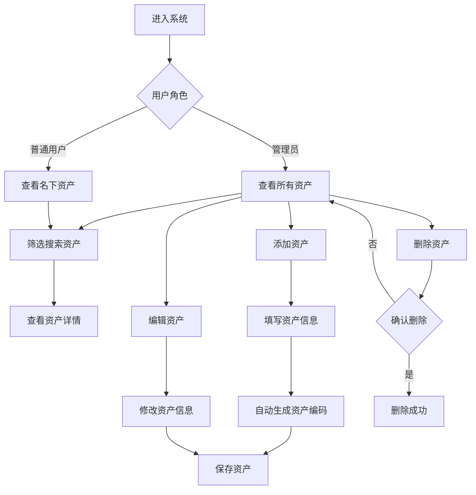
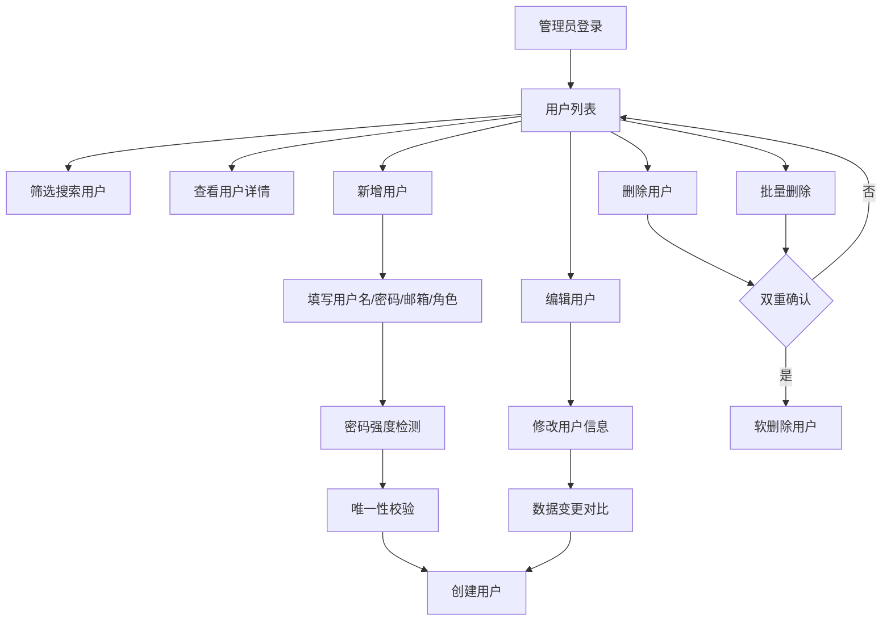
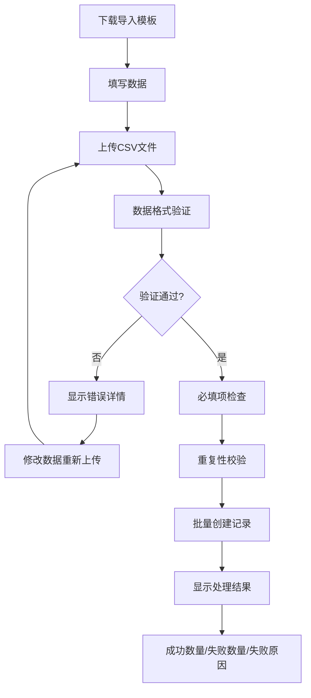

## 1. Product Overview
一个专业的IT资产管理网页应用，帮助企业高效管理IT资产的全生命周期。支持管理员和普通用户角色区分，提供资产管理、用户管理、批量导入导出、操作日志等完整功能。数据自动持久化到本地文件，无需手动导入导出。

## 2. Core Features

### 2.1 User Roles
| Role | Registration Method | Core Permissions |
|------|---------------------|------------------|
| Admin | 默认账号 | 查询所有资产、增加/删除/修改资产、管理用户、批量导入导出、查看操作日志 |
| User | 默认账号 | 查询名下资产、查看资产详情 |

### 2.2 Feature Module
1. **资产列表页**：资产表格展示、筛选搜索、角色权限控制、分页
2. **资产详情页**：完整资产信息展示、使用信息查看
3. **资产管理页**：添加资产、编辑资产、删除资产
4. **用户管理模块**：用户列表、新增用户、编辑用户、删除用户、批量删除、角色权限分配
5. **批量处理模块**：资产批量导入导出、用户批量导入导出、模板下载
6. **操作日志模块**：操作记录查询、筛选（时间/类型/操作人）、变更对比

### 2.3 Page Details
| Page Name | Module Name | Feature description |
|-----------|-------------|---------------------|
| 资产列表 | 资产表格列表 | 展示资产基本信息，支持分页、排序、筛选 |
| 资产列表 | 筛选搜索 | 按资产分类、状态、使用人等条件筛选 |
| 资产列表 | 角色权限 | 管理员查看全部资产，用户仅查看名下资产 |
| 资产详情 | 基本信息 | 展示资产编码、名称、分类、品牌、型号等 |
| 资产详情 | 使用信息 | 展示使用人、公司、部门、领用日期等 |
| 资产管理 | 添加资产 | 表单录入新资产信息，自动生成资产编码 |
| 资产管理 | 编辑资产 | 修改已有资产信息，状态变更记录 |
| 资产管理 | 删除资产 | 确认后删除资产记录 |
| 用户列表 | 用户表格 | 展示用户信息，支持分页、筛选、批量删除 |
| 用户管理 | 新增用户 | 表单录入用户信息，包含密码强度检测 |
| 用户管理 | 编辑用户 | 修改用户信息，支持角色变更 |
| 用户管理 | 删除用户 | 软删除机制，保留历史数据 |
| 批量处理 | 资产导入 | 上传CSV文件批量创建资产，含数据验证 |
| 批量处理 | 资产导出 | 下载资产数据CSV文件 |
| 批量处理 | 用户导入 | 上传CSV文件批量创建用户，含数据验证 |
| 批量处理 | 用户导出 | 下载用户数据CSV文件 |
| 批量处理 | 模板下载 | 提供标准格式的导入模板 |
| 操作日志 | 日志列表 | 展示所有操作记录，支持分页 |
| 操作日志 | 筛选查询 | 按时间、操作类型、操作人筛选 |
| 操作日志 | 变更对比 | 查看操作前后数据差异 |

## 3. Core Process

### 3.1 资产管理流程

### 3.2 用户管理流程

### 3.3 批量导入流程

## 4. User Interface Design

### 4.1 Design Style
- 主色调：科技蓝（#0F172A 深蓝、#3B82F6 亮蓝、#60A5FA 浅蓝）
- 辅助色：白色背景、灰色文字、绿色状态（正常）、黄色状态（维修中）、红色状态（故障）、紫色（管理员）、蓝色（普通用户）
- 按钮风格：圆角矩形，蓝色渐变，悬停效果
- 字体：Inter，清晰易读，专业感
- 布局：表格式布局，顶部导航栏，右侧内容区域
- 图标：lucide-react 线性图标

### 4.2 Page Design Overview
| Page Name | Module Name | UI Elements |
|-----------|-------------|-------------|
| 资产列表 | 顶部工具栏 | 搜索框、筛选下拉、新增按钮 |
| 资产列表 | 资产表格 | 表格展示、状态标签、操作按钮 |
| 资产详情 | 信息卡片 | 分栏展示基本信息和使用信息 |
| 资产管理 | 表单区域 | 输入框、下拉选择、日期选择器 |
| 用户列表 | 顶部工具栏 | 搜索框、筛选下拉、批量删除按钮 |
| 用户列表 | 用户表格 | 表格展示、角色标签、操作按钮 |
| 用户管理 | 表单区域 | 输入框、密码强度指示器、角色选择 |
| 批量处理 | 上传区域 | 文件上传按钮、模板下载链接 |
| 批量处理 | 结果展示 | 成功/失败统计、错误详情列表 |
| 操作日志 | 日志表格 | 表格展示、操作类型标签 |
| 操作日志 | 筛选区域 | 时间范围、操作类型、操作人筛选 |

### 4.3 Responsiveness
- 桌面端：顶部固定导航，表格多列布局
- 移动端：顶部导航栏，表格自适应滚动，菜单折叠
- 响应式断点：768px

### 4.4 交互设计
- 添加资产：表单验证、编码自动生成、保存成功提示
- 编辑资产：弹窗表单、修改确认提示、变更对比
- 删除资产：二次确认弹窗、删除动画效果
- 添加用户：表单验证、密码强度实时反馈、唯一性校验
- 编辑用户：数据变更对比、敏感信息额外验证
- 删除用户：双重确认机制、软删除提示
- 批量导入：进度指示、详细结果报告
- 操作日志：点击查看变更详情、筛选交互

## 5. Data Persistence
- 数据存储：本地 `data.json` 文件
- 服务端：Express 后端服务（端口 3001）
- 同步机制：状态变更后 300ms 自动写入文件
- 启动加载：应用启动时从文件加载数据

## 6. Security
- 角色权限控制（RBAC）
- 密码强度检测
- 操作日志记录（审计）
- 敏感操作双重确认