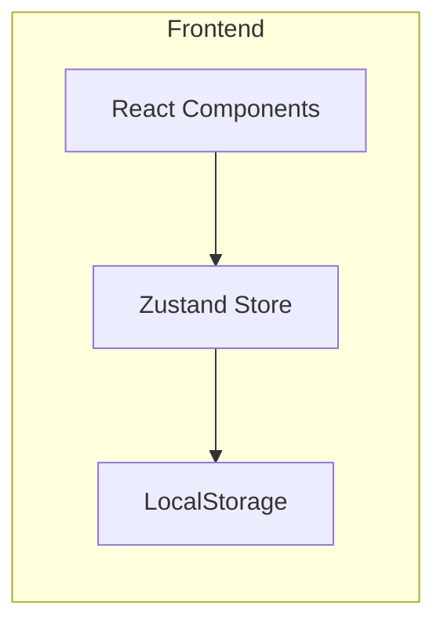
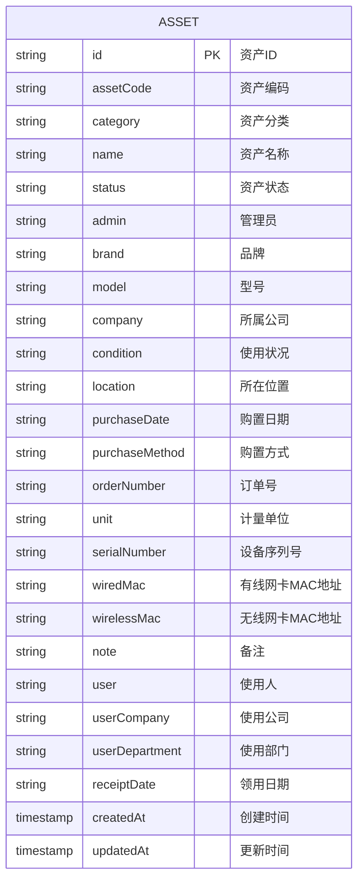

## 1. Architecture Design


## 2. Technology Description
- Frontend: React@18 + TypeScript + tailwindcss@3 + vite
- Initialization Tool: vite-init
- State Management: Zustand
- Icons: lucide-react
- Data Persistence: LocalStorage

## 3. Route Definitions
| Route | Purpose |
|-------|---------|
| / | 资产列表页面，展示所有资产 |
| /asset/:id | 资产详情页面，展示资产完整信息 |
| /asset/add | 添加资产页面，表单录入 |
| /asset/edit/:id | 编辑资产页面，修改信息 |

## 4. API Definitions
无需后端API，数据存储在LocalStorage中

## 5. Server Architecture Diagram
无需后端服务

## 6. Data Model

### 6.1 Data Model Definition


### 6.2 Data Structure
```typescript
interface Asset {
  id: string;
  assetCode: string;
  category: string;
  name: string;
  status: '空闲' | '领用' | '借用';
  admin: string;
  brand: string;
  model: string;
  company: string;
  condition: '正常' | '故障' | '维修中';
  location: string;
  purchaseDate: string;
  purchaseMethod: string;
  orderNumber: string;
  unit: string;
  serialNumber: string;
  wiredMac: string;
  wirelessMac: string;
  note: string;
  user: string;
  userCompany: string;
  userDepartment: string;
  receiptDate: string;
  createdAt: number;
  updatedAt: number;
}

interface User {
  id: string;
  username: string;
  role: 'admin' | 'user';
  company: string;
  department: string;
}
```

### 6.3 Initial Data
```typescript
const initialAssets: Asset[] = [
  {
    id: '1',
    assetCode: 'IT-2024-001',
    category: '笔记本电脑',
    name: 'MacBook Pro 14寸',
    status: '领用',
    admin: '张三',
    brand: 'Apple',
    model: 'A2779',
    company: '科技有限公司',
    condition: '正常',
    location: '总部大楼3楼',
    purchaseDate: '2024-01-15',
    purchaseMethod: '采购',
    orderNumber: 'PO-2024-001',
    unit: '台',
    serialNumber: 'C02X12345678',
    wiredMac: '00:11:22:33:44:55',
    wirelessMac: 'AA:BB:CC:DD:EE:FF',
    note: '配置：M2 Pro 10核CPU，16GB内存，512GB SSD',
    user: '李四',
    userCompany: '科技有限公司',
    userDepartment: '研发部',
    receiptDate: '2024-02-01',
    createdAt: Date.now() - 30 * 24 * 60 * 60 * 1000,
    updatedAt: Date.now() - 10 * 24 * 60 * 60 * 1000,
  },
  {
    id: '2',
    assetCode: 'IT-2024-002',
    category: '显示器',
    name: 'Dell U2722D',
    status: '空闲',
    admin: '张三',
    brand: 'Dell',
    model: 'U2722D',
    company: '科技有限公司',
    condition: '正常',
    location: '仓库',
    purchaseDate: '2024-02-20',
    purchaseMethod: '采购',
    orderNumber: 'PO-2024-005',
    unit: '台',
    serialNumber: 'CN-0123456789',
    wiredMac: '',
    wirelessMac: '',
    note: '27寸4K分辨率显示器',
    user: '',
    userCompany: '',
    userDepartment: '',
    receiptDate: '',
    createdAt: Date.now() - 20 * 24 * 60 * 60 * 1000,
    updatedAt: Date.now() - 20 * 24 * 60 * 60 * 1000,
  },
  {
    id: '3',
    assetCode: 'IT-2024-003',
    category: '打印机',
    name: 'HP LaserJet Pro',
    status: '领用',
    admin: '张三',
    brand: 'HP',
    model: 'M404dn',
    company: '科技有限公司',
    condition: '维修中',
    location: '总部大楼1楼',
    purchaseDate: '2024-03-10',
    purchaseMethod: '采购',
    orderNumber: 'PO-2024-008',
    unit: '台',
    serialNumber: 'CN-9876543210',
    wiredMac: '11:22:33:44:55:66',
    wirelessMac: '',
    note: '激光打印机，支持双面打印',
    user: '王五',
    userCompany: '科技有限公司',
    userDepartment: '行政部',
    receiptDate: '2024-03-15',
    createdAt: Date.now() - 15 * 24 * 60 * 60 * 1000,
    updatedAt: Date.now() - 5 * 24 * 60 * 60 * 1000,
  },
];

const initialUsers: User[] = [
  { id: '1', username: 'admin', role: 'admin', company: '科技有限公司', department: 'IT部' },
  { id: '2', username: '李四', role: 'user', company: '科技有限公司', department: '研发部' },
  { id: '3', username: '王五', role: 'user', company: '科技有限公司', department: '行政部' },
];
```
