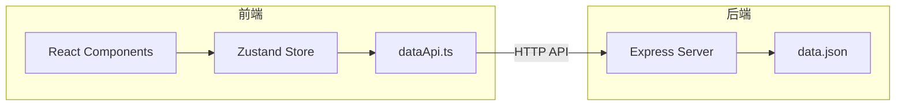
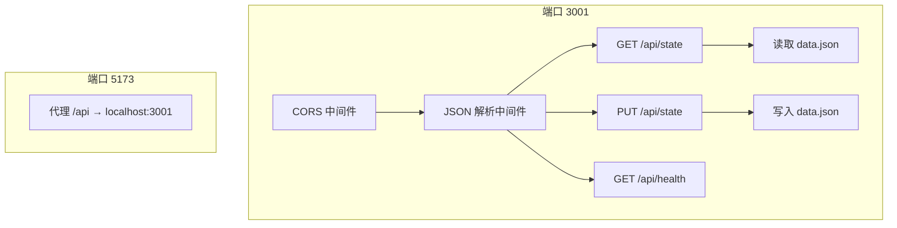
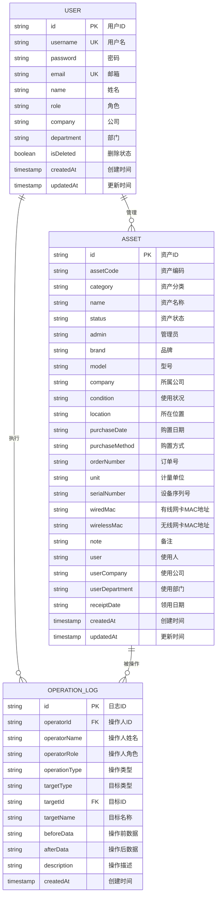
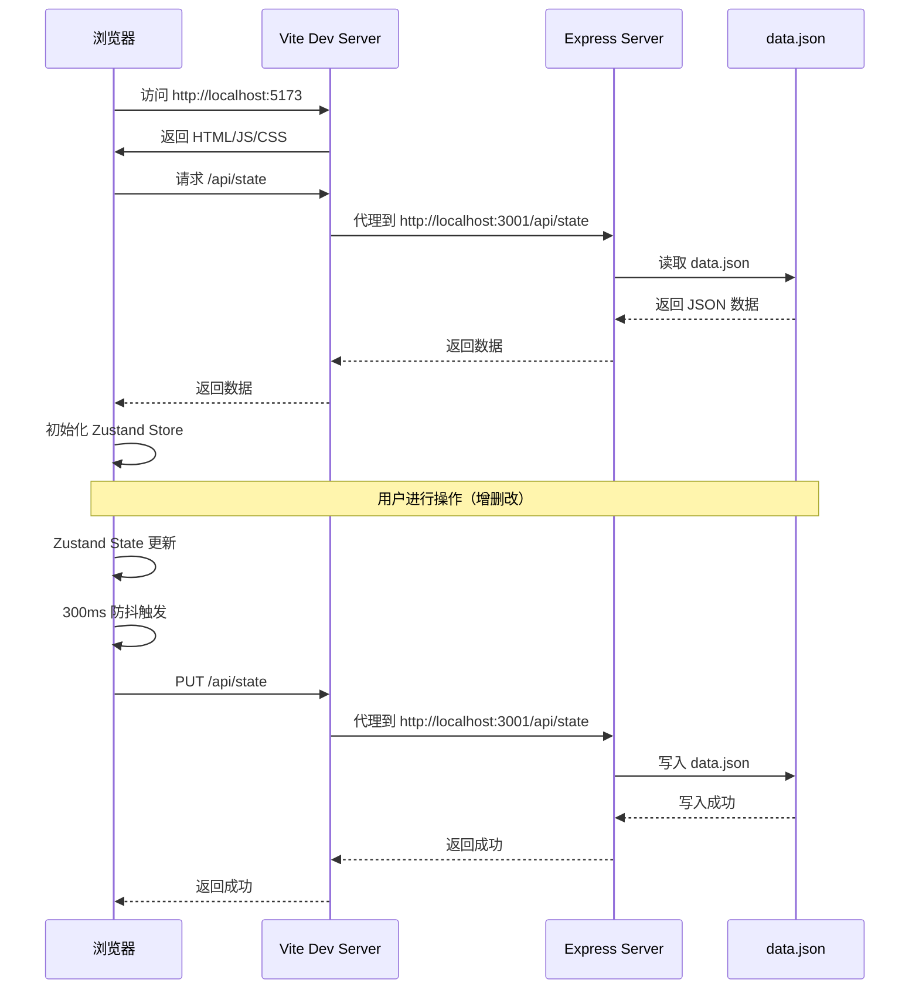

## 1. Architecture Design


## 2. Technology Description
- Frontend: React@18 + TypeScript + Tailwind CSS@3 + Vite@6
- State Management: Zustand
- Icons: lucide-react
- Data Persistence: Local `data.json` file via Express API
- Backend: Express@4 + CORS
- Build Tool: Vite with proxy configuration

## 3. Route Definitions
| Route | Purpose | Required Role |
|-------|---------|---------------|
| / | 资产列表页面，展示所有资产 | admin/user |
| /asset/:id | 资产详情页面，展示资产完整信息 | admin/user |
| /asset/add | 添加资产页面，表单录入 | admin |
| /asset/edit/:id | 编辑资产页面，修改信息 | admin |
| /users | 用户列表页面，展示所有用户 | admin |
| /user/add | 添加用户页面，表单录入 | admin |
| /user/edit/:id | 编辑用户页面，修改信息 | admin |
| /logs | 操作日志页面，展示所有操作记录 | admin |
| /batch | 批量处理页面，导入导出功能 | admin |

## 4. API Definitions

### 4.1 后端 API

| Method | Path | Description |
|--------|------|-------------|
| GET | /api/state | 获取所有数据（资产、用户、日志） |
| PUT | /api/state | 保存所有数据到 data.json |
| GET | /api/health | 健康检查 |

### 4.2 前端 API 客户端 (`src/services/dataApi.ts`)

| Function | Description |
|----------|-------------|
| `fetchState()` | 从后端获取完整状态 |
| `saveState(data)` | 将状态保存到后端 |
| `scheduleSync(getState)` | 300ms 防抖同步到后端 |

## 5. Server Architecture Diagram


## 6. Data Model

### 6.1 Data Model Definition


### 6.2 Data Structure
```typescript
interface Asset {
  id: string;
  assetCode: string;
  category: string;
  name: string;
  status: '空闲' | '领用' | '借用';
  admin: string;
  brand: string;
  model: string;
  company: string;
  condition: '正常' | '故障' | '维修中';
  location: string;
  purchaseDate: string;
  purchaseMethod: string;
  orderNumber: string;
  unit: string;
  serialNumber: string;
  wiredMac: string;
  wirelessMac: string;
  note: string;
  user: string;
  userCompany: string;
  userDepartment: string;
  receiptDate: string;
  createdAt: number;
  updatedAt: number;
}

interface User {
  id: string;
  username: string;
  password: string;
  email: string;
  name: string;
  role: 'admin' | 'user';
  company: string;
  department: string;
  isDeleted: boolean;
  createdAt: number;
  updatedAt: number;
}

type OperationType = 'CREATE' | 'UPDATE' | 'DELETE' | 'BATCH_DELETE';

interface OperationLog {
  id: string;
  operatorId: string;
  operatorName: string;
  operatorRole: 'admin' | 'user';
  operationType: OperationType;
  targetType: 'USER' | 'ASSET';
  targetId: string;
  targetName: string;
  beforeData: string;
  afterData: string;
  description: string;
  createdAt: number;
}
```

### 6.3 Initial Data
```typescript
const initialAssets: Asset[] = [
  {
    id: '1',
    assetCode: 'IT-2024-001',
    category: '笔记本电脑',
    name: 'MacBook Pro 14寸',
    status: '领用',
    admin: '张三',
    brand: 'Apple',
    model: 'A2779',
    company: '科技有限公司',
    condition: '正常',
    location: '总部大楼3楼',
    purchaseDate: '2024-01-15',
    purchaseMethod: '采购',
    orderNumber: 'PO-2024-001',
    unit: '台',
    serialNumber: 'C02X12345678',
    wiredMac: '00:11:22:33:44:55',
    wirelessMac: 'AA:BB:CC:DD:EE:FF',
    note: '配置：M2 Pro 10核CPU，16GB内存，512GB SSD',
    user: '李四',
    userCompany: '科技有限公司',
    userDepartment: '研发部',
    receiptDate: '2024-02-01',
    createdAt: Date.now() - 30 * 24 * 60 * 60 * 1000,
    updatedAt: Date.now() - 10 * 24 * 60 * 60 * 1000,
  },
  {
    id: '2',
    assetCode: 'IT-2024-002',
    category: '显示器',
    name: 'Dell U2722D',
    status: '空闲',
    admin: '张三',
    brand: 'Dell',
    model: 'U2722D',
    company: '科技有限公司',
    condition: '正常',
    location: '仓库',
    purchaseDate: '2024-02-20',
    purchaseMethod: '采购',
    orderNumber: 'PO-2024-005',
    unit: '台',
    serialNumber: 'CN-0123456789',
    wiredMac: '',
    wirelessMac: '',
    note: '27寸4K分辨率显示器',
    user: '',
    userCompany: '',
    userDepartment: '',
    receiptDate: '',
    createdAt: Date.now() - 20 * 24 * 60 * 60 * 1000,
    updatedAt: Date.now() - 20 * 24 * 60 * 60 * 1000,
  },
  {
    id: '3',
    assetCode: 'IT-2024-003',
    category: '打印机',
    name: 'HP LaserJet Pro',
    status: '领用',
    admin: '张三',
    brand: 'HP',
    model: 'M404dn',
    company: '科技有限公司',
    condition: '维修中',
    location: '总部大楼1楼',
    purchaseDate: '2024-03-10',
    purchaseMethod: '采购',
    orderNumber: 'PO-2024-008',
    unit: '台',
    serialNumber: 'CN-9876543210',
    wiredMac: '11:22:33:44:55:66',
    wirelessMac: '',
    note: '激光打印机，支持双面打印',
    user: '王五',
    userCompany: '科技有限公司',
    userDepartment: '行政部',
    receiptDate: '2024-03-15',
    createdAt: Date.now() - 15 * 24 * 60 * 60 * 1000,
    updatedAt: Date.now() - 5 * 24 * 60 * 60 * 1000,
  },
];

const initialUsers: User[] = [
  { id: '1', username: 'admin', password: 'admin123', email: 'admin@company.com', name: '管理员', role: 'admin', company: '科技有限公司', department: 'IT部', isDeleted: false, createdAt: Date.now() - 60 * 24 * 60 * 60 * 1000, updatedAt: Date.now() - 30 * 24 * 60 * 60 * 1000 },
  { id: '2', username: 'lisi', password: 'lisi123', email: 'lisi@company.com', name: '李四', role: 'user', company: '科技有限公司', department: '研发部', isDeleted: false, createdAt: Date.now() - 30 * 24 * 60 * 60 * 1000, updatedAt: Date.now() - 10 * 24 * 60 * 60 * 1000 },
  { id: '3', username: 'wangwu', password: 'wangwu123', email: 'wangwu@company.com', name: '王五', role: 'user', company: '科技有限公司', department: '行政部', isDeleted: false, createdAt: Date.now() - 25 * 24 * 60 * 60 * 1000, updatedAt: Date.now() - 5 * 24 * 60 * 60 * 1000 },
];
```

## 7. Project Structure
```
bill/
├── server/
│   └── index.js                    # Express 后端服务
├── src/
│   ├── components/
│   │   ├── Header.tsx              # 顶部导航栏
│   │   ├── AssetCard.tsx           # 资产卡片（旧版，保留）
│   │   └── UserCard.tsx            # 用户卡片（旧版，保留）
│   ├── pages/
│   │   ├── AssetListPage.tsx       # 资产列表页（表格布局）
│   │   ├── AssetDetailPage.tsx     # 资产详情页
│   │   ├── AssetFormPage.tsx       # 资产表单页（添加/编辑）
│   │   ├── UserListPage.tsx        # 用户列表页（表格布局）
│   │   ├── UserFormPage.tsx        # 用户表单页（添加/编辑）
│   │   ├── OperationLogPage.tsx    # 操作日志页
│   │   └── BatchImportPage.tsx     # 批量导入导出页
│   ├── services/
│   │   └── dataApi.ts              # 数据 API 客户端
│   ├── store/
│   │   └── assetStore.ts           # Zustand 状态管理
│   ├── types/
│   │   └── index.ts                # TypeScript 类型定义
│   ├── lib/
│   │   ├── csv.ts                  # CSV 解析/生成工具
│   │   └── utils.ts                # 通用工具函数
│   ├── App.tsx                     # 应用入口，路由配置
│   ├── main.tsx                    # React 渲染入口
│   └── index.css                   # 全局样式（Tailwind）
├── index.html                      # HTML 模板
├── package.json                    # 项目依赖和脚本
├── vite.config.ts                  # Vite 配置（含代理）
├── tsconfig.json                   # TypeScript 配置
├── tailwind.config.js              # Tailwind 配置
├── postcss.config.js               # PostCSS 配置
└── data.json                       # 本地数据文件（运行时自动创建）
```

## 8. Key Store Methods
| Method | Description |
|--------|-------------|
| `addAsset(asset)` | 添加资产，自动生成编码 |
| `updateAsset(id, updates)` | 更新资产 |
| `deleteAsset(id)` | 删除资产 |
| `addUser(user)` | 添加用户，含唯一性校验和密码强度检测 |
| `updateUser(id, updates)` | 更新用户 |
| `deleteUser(id)` | 软删除用户 |
| `batchDeleteUsers(ids)` | 批量软删除用户 |
| `addOperationLog(log)` | 添加操作日志 |
| `getUsersWithPagination(page, pageSize)` | 用户分页查询 |
| `getLogsWithPagination(page, pageSize)` | 日志分页查询 |
| `exportAssetsCSV()` | 导出资产 CSV |
| `exportUsersCSV()` | 导出用户 CSV |
| `importAssetsFromCSV(file)` | 导入资产 CSV |
| `importUsersFromCSV(file)` | 导入用户 CSV |
| `hydrate()` | 从后端加载初始数据 |

## 9. Data Flow


## 10. Security Considerations
- **Role-Based Access Control (RBAC)**: 前端路由和组件级权限控制
- **Password Strength Check**: 用户创建时密码强度检测（至少6位）
- **Soft Delete**: 用户删除采用软删除机制，保留历史数据
- **Operation Logging**: 所有操作记录日志，支持审计追溯
- **Input Validation**: 表单验证、数据格式校验、唯一性检查